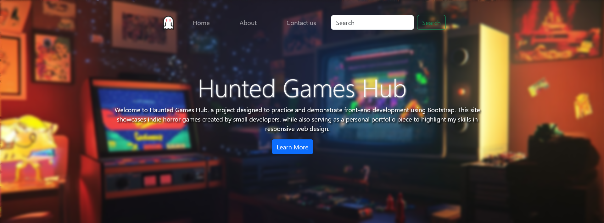
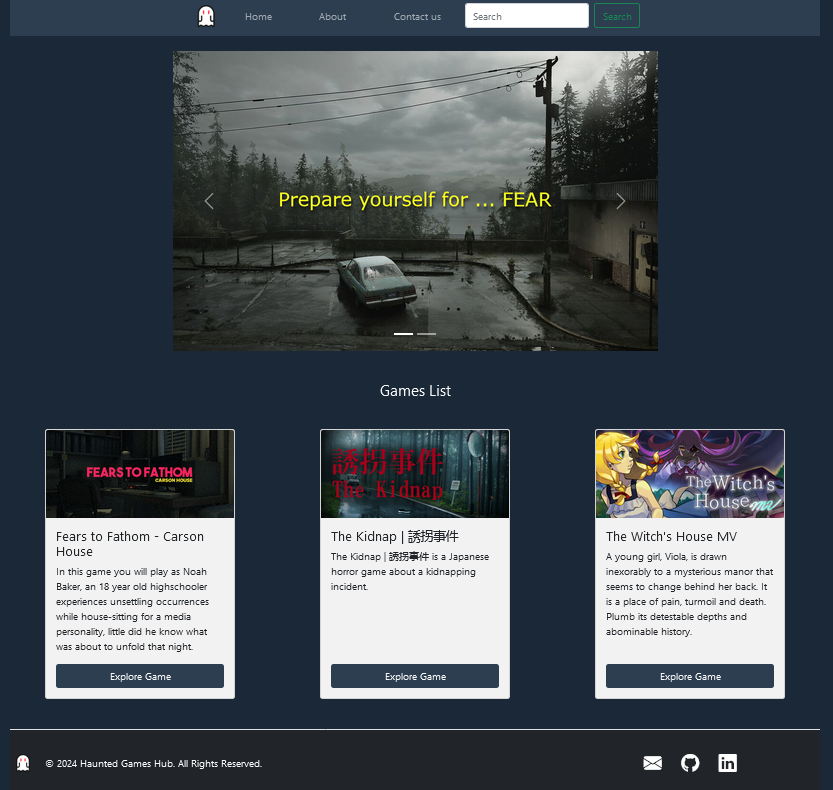

# Haunted Games Hub

## Description
A front-end web project designed using Bootstrap, showcasing horror video games developed by individuals or small companies. This project was created to practice Bootstrap and is shared on GitHub for learning and portfolio purposes.

## Features
- Responsive design using Bootstrap
- Carousel for showcasing images
- Cards highlighting individual games with descriptions
- Simple navigation bar and footer

## Technologies Used
- HTML
- CSS
- Bootstrap 5

## Screenshots
- index.html : 

- home.html

